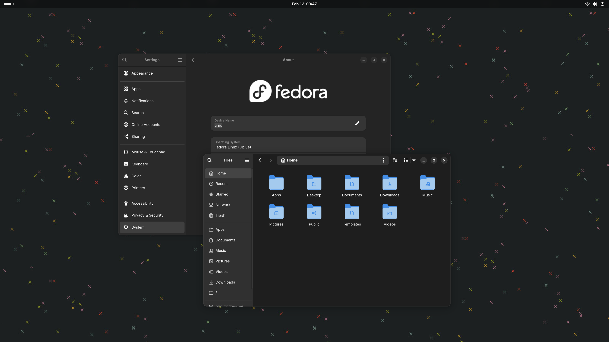

# Just Fedora Silverblue™

Just basic Fedora Silverblue, but it has tweaks that make it perfect for my use! It uses Universal Blue as a base, and contains some included packages and extensions, a slightly altered look, Nvidia drivers and the Bazzite kernel. I repeat, this was made for *me*. I wouldn't recommend anyone else use it, but you can if you really want to.



Primarily customized for the computers I own, but there is an untested "generic" build.

- Desktop: Ryzen 9 5900x + RTX 3070
- Laptop: Lenovo Legion 5 Slim 14", Ryzen 7 7840HS + RTX 4060 Max-Q

# Installing
- First, rebase with unsigned image:
```diff
rpm-ostree rebase ostree-unverified-registry:ghcr.io/clc1101/personalblue:latest
# for desktop build
rpm-ostree rebase ostree-unverified-registry:ghcr.io/clc1101/personalblue-desktop:latest
# for laptop build
rpm-ostree rebase ostree-unverified-registry:ghcr.io/clc1101/personalblue-laptop:latest
```

- Reboot:
```
systemctl reboot
```

- Then, you can rebase to the signed image:
```diff
rpm-ostree rebase ostree-image-signed:docker://ghcr.io/clc1101/personalblue:latest
# for desktop build
rpm-ostree rebase ostree-image-signed:docker://ghcr.io/clc1101/personalblue-desktop:latest
# for laptop build
rpm-ostree rebase ostree-image-signed:docker://ghcr.io/clc1101/personalblue-laptop:latest
```
- Reboot again:
```
systemctl reboot
```

- For secure boot support
```
ujust enroll-secure-boot-key
```

To fully utilize hardware video acceleration on Firefox, set the following settings in about:config
```
media.ffmpeg.vaapi.enabled=true
media.rdd-ffmpeg.enabled=true
gfx.x11-egl.force-enabled=true
```

> [!NOTE]
> 2nd and 3rd settings are only necessary if your primary GPU is from Nvidia.

Apologies in advance if this is poorly put together. I'm an artist, not a programmer.
